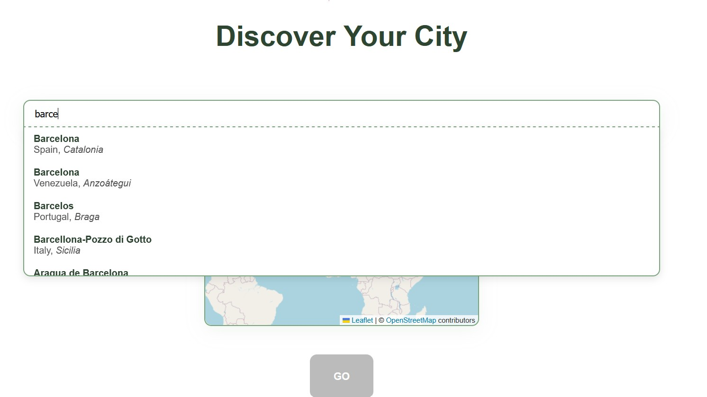
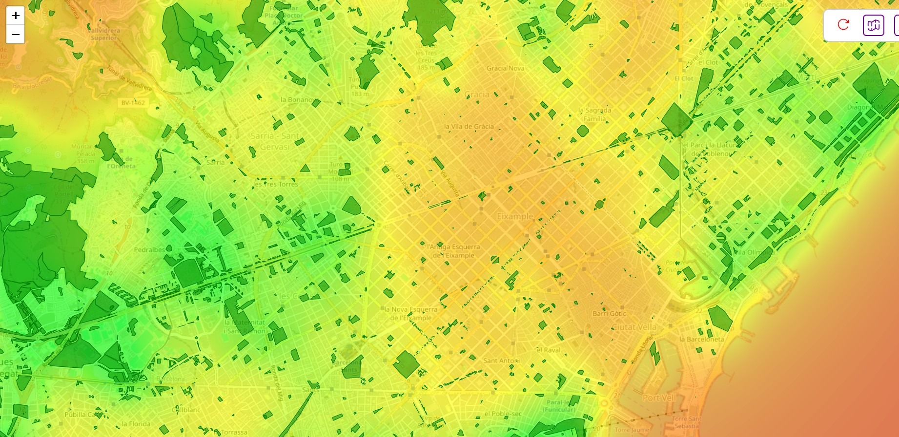

# Greenalize
## Description

Greenalize is a web application for exploring parks and green spaces on an interactive map. It features a heatmap visualization to highlight areas with strong or weak access to green spaces. Built with React, TypeScript, Vite, and Leaflet, Greenalize is fast, modern, and scaleable.

**Now available online at [https://greenalize.vercel.app/](https://greenalize.vercel.app/)**

## Features

- Interactive map for viewing parks  
- Heatmap layer to visualize park distribution  
- Optional park detail popups  
- Fast development with Vite  
- Type-safe codebase using TypeScript  
- Responsive layout for mobile and desktop  

## Screenshots

<br/>


## Technology Stack

| Category | Technology |
|---------|------------|
| Frontend Framework | React |
| Bundler | Vite |
| Language | TypeScript |
| Map Library | Leaflet |

## Instructions

### Installation 

```bash
git clone https://github.com/BAD353/Greenalize.git

cd Greenalize

npm install
```

### Development 

To start the server, run
```bash
npm run dev
```

Open in the browser
```
http://localhost:5173
```

### Production 

```bash
npm run build
```
